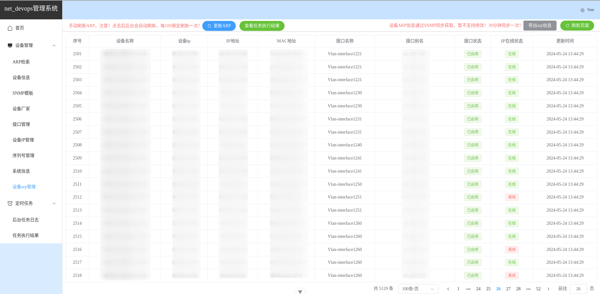

# net_devops

#### 介绍
嗨，本人的一个小demo（非专业开发，本职是修网络）。通过Python 后端定时采集设备的ARP信息，提供给前端页面可以进行实时的搜索。
目前已经实现的功能有采集设备的序列号、设备的接口信息、设备的IP配置信息、设备的系统版本、ARP信息。

本人精力有限，登录页等后续功能还未完成。后续功能不定期更新。走过路过留个start❤。
gitee主页： [链接](https://gitee.com/Zhangqiuxian) 	github主页 ：[链接](https://github.com/Zhang-qiuxian)   在线预览网址：[链接](https://120.79.17.3/)

#### 软件架构
软件架构说明
本工具采用前后端分离的架构，前端采用vue3+element plus，后端使用django rest framework + Celery定时任务。
前端负责页面展示，后端负责数据采集和API接口。


#### 安装教程

1. 拉取项目代码
```shell
git clone https://gitee.com/Zhangqiuxian/net_devops.git
```
1. 前端安装教程

   > 参考net-admin/README.md

2. 后端安装教程

   > 参考django_server/README.md

3. 一键安装教程

   > 在项目根目录上有 `install.sh` shell脚本。**请勿在生产环境中使用**，脚本适用于Ubuntu/Debian,最好提供一个干净的系统做测试。该脚本会在电脑上编译安装`Python 3.12.3`，`nodejs 22.2.0`还要确保服务器能联网。

##### 版本要求

```shell
操作系统： Linux
Python >= 3.10
Nodejs >= 18.20.3
```

#### 项目演示

> 所有从设备上获取到的信息均能导出到本地

1. 主页

   

2. ARP检索，只有SNMP同步过后才能搜索。

   

3. 设备信息，添加设备以同步设备信息。可以批量导入导出设备。

   

4. SNMP模板，配置团字体来同步设备信息。在设备导入时必须要将序号和设备的snmp_id对应否则无法同步

   

5. 接口管理，收集接口信息

   

6. 设备IP管理，收集设备上配置的IP信息

   

7. 序列号管理

   

8. 设备信息

   

9. ARP信息，支持手动更新ARP

   

10. 任务执行结果

    

#### 参与贡献

1.  Fork 本仓库
2.  新建 Feat_xxx 分支
3.  提交代码
4.  新建 Pull Request


#### 特技

1.  使用 Readme\_XXX.md 来支持不同的语言，例如 Readme\_en.md, Readme\_zh.md
2.  Gitee 官方博客 [blog.gitee.com](https://blog.gitee.com)
3.  你可以 [https://gitee.com/explore](https://gitee.com/explore) 这个地址来了解 Gitee 上的优秀开源项目
4.  [GVP](https://gitee.com/gvp) 全称是 Gitee 最有价值开源项目，是综合评定出的优秀开源项目
5.  Gitee 官方提供的使用手册 [https://gitee.com/help](https://gitee.com/help)
6.  Gitee 封面人物是一档用来展示 Gitee 会员风采的栏目 [https://gitee.com/gitee-stars/](https://gitee.com/gitee-stars/)
