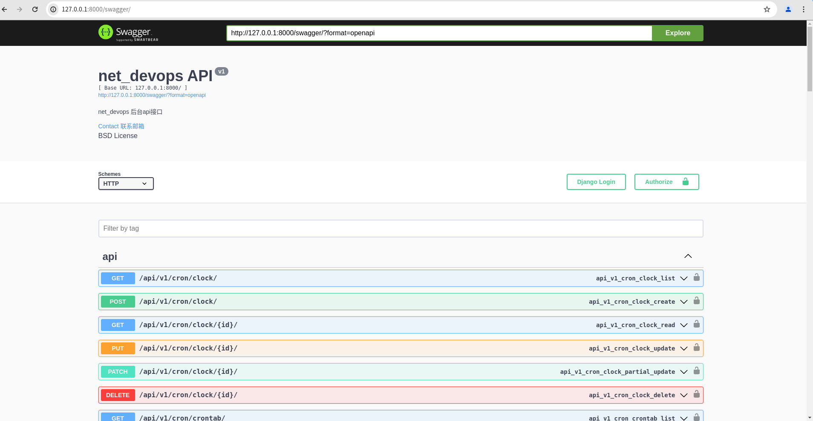

# net_devops 一个基于Django REST Framework的项目


### 介绍

net_devops 是一个基于`Django REST Framework`构建的Web服务项目。它提供了API接口，用于与后端数据库进行交互，并支持前后端分离的开发模式。

###  安装/设置

- **系统要求**：本人开发环境`Ubuntu22.04 LTS`，其它`Linux`环境也大差不差。

- **依赖项**：由于后端需要通过`SNMP`来获取设备信息，请确保操作系统是`Linux`。定时任务依赖`redis`，后端数据库可选择`mysql、postgre、sqlit3`随便一种，只需要看效果就无脑选`sqlite3`。

首先将项目克隆到本地（如果已经克隆了就忽略），代码的目录如图

```shell
git clone https://gitee.com/Zhangqiuxian/net_devops.git
```

代码目录

```md
── net_devops
    ├── 架构图.drawio
    ├── django_server
    ├── install.sh
    ├── net-admin
    ├── net-web
    └── README.md
```


安装必要依赖包

- Ubuntu/Debian

  ```shell
  sudo apt-get -y install snmp* libsnmp-dev libmysqlclient-dev libpq-dev python3-dev redis  default-libmysqlclient-dev build-essential pkg-config libpq5
  ```

- Centos/OpenEuler

  ```shell
  sudo yum install -y install net-snmp*  python3-dev redis mysql-devel pkgconfig postgresql-devel*
  ```

- Python虚拟环境
  
  ```shell
  # Pyhton >= 3.10
  python -m venv net_devops/venv
  sudo groupadd net_devops
  sudo useradd -s /bin/bash -g net_devops net_devops
  sudo chown -R net_devops:net_devops net_devops/
  cd net_devops/django_server/
  source ../venv/bin/activate
  pip install -i https://mirror.nju.edu.cn/pypi/web/simple -r requirements.txt
  ```
  
- 数据库迁移

  ```shell
  chmod +x manage.py
  ./manage.py makemigrations && ./manage.py migrate
  ```

- 运行服务，需要将`ip`替换为服务器的IP地址

  ```shell
  ./manage.py runserver 电脑IP:8000
  ```

### 后端验证

后端的接口文档地址

```http
http://电脑IP:8000/api/swagger/
```

如看到以下界面就说明后端已启动



### 启动Celery

首先先确保数据库已经迁移，只做测试的话就再开两个窗口，只要修改了tasks里面的代码务必请重启celery的两个服务

- 启动定时任务

  ```shell
  cd django_server/
  python -m venv venv
  source venv/bin/activate
  celery -A django_server beat -l INFO --scheduler django_celery_beat.schedulers:DatabaseScheduler
  ```

看到以下输出就说明定时任务已启动


- 启动celery

```shell
cd django_server/
python -m venv venv
source venv/bin/activate
celery -A django_server worker -l INFO
```

看到以下输出就说明Celery已经启动


### 至此后端服务已启动完成
